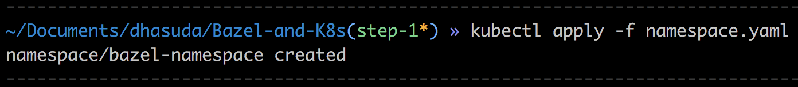
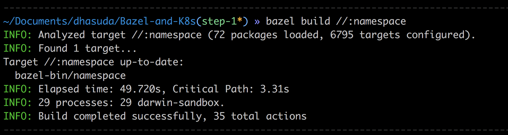
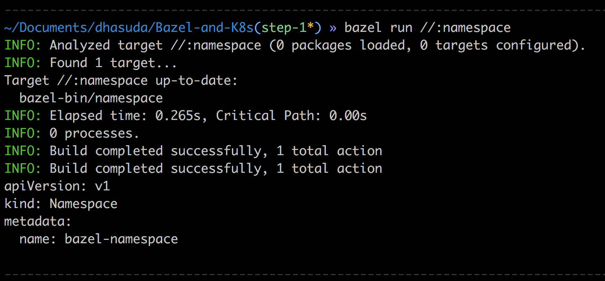
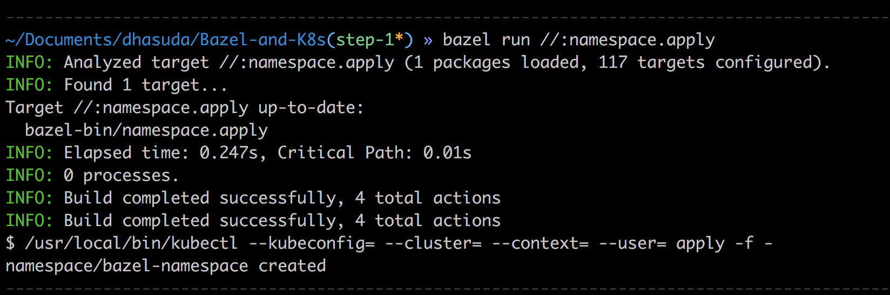
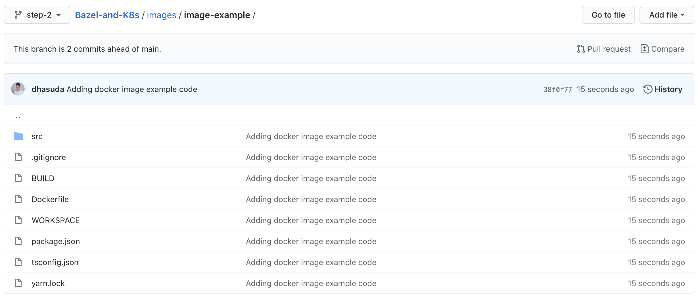
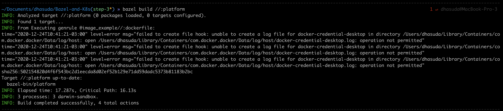
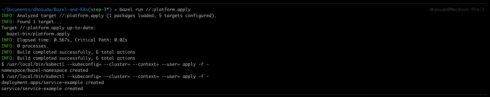
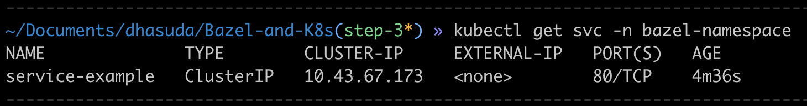

# Migrating our Kubernetes infrastructure to a monorepo (+Tutorial)

At VTEX, when creating our platform as a service, we've seen the need to implement a CI/CD pipeline in the cloud.
It was necessary to create a code pipeline integrated with GitHub that, after every new commit, we'd be able to build the entire store and run some tests with it.

To build such infrastructure, we decided to use [Kubernetes](https://kubernetes.io).
Luckily, [Tekton CD](https://tekton.dev) is an open-source framework for creating CI/CD pipelines built for K8s (Kubernetes).
So, we started using it as well as our infrastructure base.

As we developed our platform code base, with multiple repositories involved, we've realized the importance of having a centralized structure where we could know everything that was in production.

But before I get to the monorepo itself, let me talk a little about our purpose building this platform, our challenges and some context that may be important for you to fully understand this article.

## 🏗 What we're building
Our goal is to build a framework for building blazing fast stores.
No surprise we choose to use [Gatsby](https://www.gatsbyjs.com) as our front-end generator — once it aims to [build blazing fast websites with React](https://www.freecodecamp.org/news/why-you-should-use-gatsbyjs-to-build-static-sites-4f90eb6d1a7b/).

But, to build ecommerce stores with Gatsby, we need to perform a lot of builds.
Every change in the store must trigger a new build.
To create the infrastructure that would process all of this builds, we've settled with Tekton CD running on a Kubernetes.

As we want to guarantee quality and performance of all the builds, we've integrated several checks and tests in the build pipeline.
The code is analyzed by [Sonarqube](https://www.sonarqube.org), we also run some [Lighthouse](https://developers.google.com/web/tools/lighthouse) and custom end-to-end [cypress](https://www.cypress.io) tests with the deploy preview we're able to generate for each build.
None of this techologies will be the focus here, but if you want to know more about them, feel free to click the links.

As usual, we've also integrated everything with [GitHub](https://github.com), using the checks available for each commit.

## 💭 What we didn't knew at the beginning 
As you can imagine, we've created a lot of CRDs ([Custom Resource Definition](https://kubernetes.io/docs/concepts/extend-kubernetes/api-extension/custom-resources/)) for our Kubernetes.
As well as a lot of docker images that were used by our pods in each build step.
As any project in the beginning, in that moment we didn't know yet all of the best practices that will take place once we start scaling the project, we just started the code putting all the yamls of the CRDs in one repo, and each Docker image we generated had the source code in a different GitHub repository.

As the project grew, it became noticeable that it was not a good approach.
Let's say we want to add a new build step to our pipeline with actions complex enough that we couldn't handle with only bash scripts or already existing Docker images.
We'd need to create a new Docker image, build it and push it to ECR([Elastic Container Registry](https://aws.amazon.com/ecr/)) or [DockerHub](https://hub.docker.com).
After that, we could reference such image in our CRDs and apply them.

As the project matured, and more people got involved, we've seen that the onboarding on the project was getting harder and harder.
Everytime, there was a new repository with some part of the system.
All the relationships among all the parts of the platform were getting very complex, and keeping each part in a different repository was not helping.

Another problem that emerged with the increasing complexity of project, was the deploy.
At a given time, we decided to follow with a multi-cluster approach: there would be one cluster to build the sites and another one to host them.
From an architectural stand point, this makes a lot of sense.
But the way we had organized our code, it was a mess.
Deploying in different clusters was not a good experience, and there was a lot that could go wrong.
We could, for example, forget one configuration that needed to be synced among clusters.

Moving to a new solution for our own development experience was a growing necessity.

## 🧠🌩 Why monorepo?

To solve such complex scenario, we need a simple way of stablishing all the relationships among all the parts of the system.
Also, it would be really important to have easy access to all of this parts.
Moreover, the build, test and deploy of the hole platform should be really easy.
So easy that the onboarding of a new team player becames farily simple.

That's when started considering a [Monorepo](https://en.wikipedia.org/wiki/Monorepo).
Note that a monorepo is very different from a monolithic application.
It puts all the code togheter in a cohesive way, but does not force the application to be a monolith.
Indeed, we are developing a multi-cluster solution.

Monorepos aim to put all the resources needed for an application in one place.
For that, we need to make very clear all the dependencies among all the parts of the system, and automate the communication between them when building the application.
The technology we choose for our use case was [Bazel](https://bazel.build), which is a build and test tool.
With that, what we need to do is describe how the parts of the system must be build, including the dependencies among them, and Bazel takes care of the rest.
It also gives us a lot of advantages, such as build caching, which can be very productive when dealing with a complex system that builds a lot of docker images.

Let's talk about our case!

We used Bazel to describe how the build, run and apply of the CRDs and Docker images would happen.
With that, with one single command we could:
- validate all yamls
- build and push all docker images
- bind the correct docker image to the CRDs that use them
- apply the configurations to a Kubernetes cluster

Much easier to test and evolve the platform!
And it also saves us from some mechanical work that represented potential failure points.

In order to describe in more details some of the challenges we faced, we organized a simple getting started tutorial.
This is useful if you consider moving your K8s application to a monorepo structure, but is not sure about the tradeoffs you may encounter.
At the end of the tutorial, you'll have a functional monorepo that is capable of deploying a full aplication to a Kubernetes cluster.

# 🥣 Tutorial
In this section, you can have a better understanding of some of the issues we faced while developing our solution.

Hopefully, you can use it as a getting started for your own project.
## ⚙️ Setup
Before starting, we need to make sure that everything is correctly installed:

- [Kubectl](https://kubernetes.io/docs/tasks/tools/install-kubectl/): this is a CLI for Kubernetes. We're going to reuse its configurations for our Bazel build
- [Bazel](https://docs.bazel.build/versions/master/install.html): the build tool

  **⚠️ Warning:** This tutorial was completed with version `3.2.0` of Bazel. Newer versions may not work with `rules_docker` that are present in step 2.
- [Docker](https://docs.docker.com/get-docker/): help us generate and manage images

You may also need a Kubernetes cluster for applying everything.
If you don't have access to one in the cloud, you can use [Minikube](https://minikube.sigs.k8s.io/docs/start/).
To start minikube, do `minikube start`.

## 🧱 Monorepo construction

As we had some previous context about Bazel, this choice was not that difficult.
But we've never built a Kubernetes service using Bazel, so we started looking for rules that could serve our purposes.

Right away, we found [Bazel Kubernetes Rules](https://github.com/bazelbuild/rules_k8s) and by reading its documentation, we've seen that it covered what we needed: full integration with Docker images and capability of applying everything to the cluster with very little effort.

That's a great start!
So, just to start our project, we created a new repository for our monorepo, and added  the BUILD and WORKSPACE files to it!

To help you visualize everything, you can access [this repo](https://github.com/dhasuda/Bazel-and-K8s).
We've divided it into branches that aim to help understand all the steps.
Go to [`step-1` branch](https://github.com/dhasuda/Bazel-and-K8s/tree/step-1) for this part.
All the code necessary is alredy in the repository, you don't need to code anything, the important part is to understand what each file is doing.

### Step 1: initialization

In the WORKSPACE file we need to declare all of our dependencies. This is necessary for Bazel to create an hermetic environment for all of our builds.

`WORKSPACE`
```
# K8s
load("@bazel_tools//tools/build_defs/repo:http.bzl", "http_archive")

# https://github.com/bazelbuild/rules_docker/#setup
# http_archive("io_bazel_rules_docker", ...)

http_archive(
    name = "io_bazel_rules_k8s",
    strip_prefix = "rules_k8s-0.5",
    urls = ["https://github.com/bazelbuild/rules_k8s/archive/v0.5.tar.gz"],
    sha256 = "773aa45f2421a66c8aa651b8cecb8ea51db91799a405bd7b913d77052ac7261a",
)

load("@io_bazel_rules_k8s//k8s:k8s.bzl", "k8s_repositories")

k8s_repositories()

load("@io_bazel_rules_k8s//k8s:k8s_go_deps.bzl", k8s_go_deps = "deps")

k8s_go_deps()

## Docker
load("@bazel_tools//tools/build_defs/repo:http.bzl", "http_archive")

http_archive(
    name = "io_bazel_rules_docker",
    sha256 = "1698624e878b0607052ae6131aa216d45ebb63871ec497f26c67455b34119c80",
    strip_prefix = "rules_docker-0.15.0",
    urls = ["https://github.com/bazelbuild/rules_docker/releases/download/v0.15.0/rules_docker-v0.15.0.tar.gz"],
)

load(
    "@io_bazel_rules_docker//repositories:repositories.bzl",
    container_repositories = "repositories",
)
container_repositories()

load("@io_bazel_rules_docker//repositories:deps.bzl", container_deps = "deps")

container_deps()

load(
    "@io_bazel_rules_docker//container:container.bzl",
    "container_pull",
)

container_pull(
  name = "java_base",
  registry = "gcr.io",
  repository = "distroless/java",
  digest = "sha256:deadbeef",
)

container_pull(
  name = "node_image",
  registry = "docker.io",
  repository = "node",
  tag = "12-alpine"
)
```

As you can see, we're declaring that we're going to use [rules_k8s](https://github.com/bazelbuild/rules_k8s) and [rules_docker](https://github.com/bazelbuild/rules_docker/#setup).

There is an `.yaml` file as well. For this example, we'd like to use a very simple configuration, that simply defines a K8s namespace.
`namespace.yaml`
```
apiVersion: v1
kind: Namespace
metadata:
  name: bazel-namespace
```
If you try to apply it with kubectl, you might see something like this:


But we want to be able to run and apply it using Bazel. Let's add the build configuration to our BUILD file:
`BUILD`
```
load("@io_bazel_rules_k8s//k8s:object.bzl", "k8s_object")

k8s_object(
  name = "namespace",
  cluster = "",
  template = "//:namespace.yaml",
  visibility = ["//visibility:public"],
)
```
The BUILD file describes how a target must be built.
We are useing the [`k8s_object` rule](https://github.com/bazelbuild/rules_k8s#k8s_object) that will get the CRD from `namespace.yaml`.

With that, we're going to be able to validate the `yaml` and apply it using Bazel. See the following commands:
#### `bazel build //:namespace`
Validates de CRD.


#### `bazel run //:namespace`
Resolves the yaml file and logs the result.


#### `bazel run //:namespace.apply`
Applies the resolved yaml to the Kubernetes cluster.


### Step 2: adding an image

Let's start by adding an image source code to the monorepo. We've organize it into the `images` folder.
Furthermore, if you already took a look at the [rules_docker](https://github.com/bazelbuild/rules_docker/#setup), you may have seen that they propose a new way of generating the image that doesn't require a Dockerfile.
But since our team at VTEX is already used to creating Dockerfiles and we don't really have experience with translating it to `rules_docker`, we came up with a more generic approach.
In our solution, we managed to use `rules_docker`, but still using a Dockerfile to generate de image.

Here's the code of our image:

If you open the `Dockerfile`, you'll notice a lot of `ARG` commands. This is because Bazel, when creating the hermetic environment for the build, also moves to a new folder.
Therefore, we need to pass these values dynamically.

Let's define this image as a new Bazel workspace. To do that, we need to create `WORKSPACE` and `BUILD` files in `/images/image-example`
`WORKSPACE` defines all dependencies for that part of the code, and we are creating a new workspace here to isolate this part of the code from the rest.
The dependency needed to build the image is basically the `rules_docker`.
```
load("@bazel_tools//tools/build_defs/repo:http.bzl", "http_archive")

http_archive(
    name = "io_bazel_rules_docker",
    sha256 = "1698624e878b0607052ae6131aa216d45ebb63871ec497f26c67455b34119c80",
    strip_prefix = "rules_docker-0.15.0",
    urls = ["https://github.com/bazelbuild/rules_docker/releases/download/v0.15.0/rules_docker-v0.15.0.tar.gz"],
)

load(
    "@io_bazel_rules_docker//repositories:repositories.bzl",
    container_repositories = "repositories",
)
container_repositories()

load("@io_bazel_rules_docker//repositories:deps.bzl", container_deps = "deps")

container_deps()

load(
    "@io_bazel_rules_docker//container:container.bzl",
    "container_pull",
)

container_pull(
  name = "java_base",
  registry = "gcr.io",
  repository = "distroless/java",
  digest = "sha256:deadbeef",
)
```

and the `BUILD` all the steps to generate the image:
```
load("@io_bazel_rules_docker//container:container.bzl", "container_image")

load("@rules_pkg//:pkg.bzl", "pkg_tar")
load("@io_bazel_rules_docker//docker/util:run.bzl", "container_run_and_commit")

pkg_tar(
    name = "src-tar",
    srcs = glob(["src/**"]),
    # Otherwise all directories are flattened:
    # <https://github.com/bazelbuild/rules_docker/issues/317>
    strip_prefix = ".",
)

genrule(
  name = "dockerfile",
  srcs = [
      "//:package.json",
      "//:tsconfig.json",
      "//:Dockerfile",
      "//:yarn.lock",
      ":src-tar",
    ],
  cmd = "tar -czh . | \
  docker build -q -t image-test -f $(location Dockerfile) \
  --build-arg yarnlock=$(location yarn.lock) \
  --build-arg tsconfig=$(location tsconfig.json) \
  --build-arg src=$(location :src-tar) \
  --build-arg package=$(location package.json) \
  --build-arg yarnlock=$(location yarn.lock) \
  --build-arg tsconfig=$(location tsconfig.json) - && docker save --output $@ image-test",
  outs = ["image-test.tar"],
)

container_image(
    name = "image",
    base = "//:dockerfile",
    visibility = ["//visibility:public"],
)
```
Note that here we're using three different Bazel rules. The first one, `pkg_tar`, is simply to avoid Bazel flattening our directories.
[The `genrule`](https://docs.bazel.build/versions/master/be/general.html#genrule) is a generic rules where you can define a script to run.
In this case, the script triggers the `docker build` command, passing as `--build-arg` the paths for the files our Dockerfile needs.
All of this `--build-arg`s are accessible in the Dockerfile after the `ARG` command.
Finally, the `container_image` rule is the from `rules_docker`.
This will be necessary for us to bind with K8s CRDs.

Let's just test if the build is working with Bazel? From the root of your directory, you can trigger the build of targets from other workspaces if you first declare them in the "root" `WORKSPACE`:
```
local_repository(
  name = "image_example",
  path = "images/image-example",
)

# K8s
...
```
This is necessary because other workspaces are also considered external dependencies.

To test, run:
#### `bazel build @image_example//:image`


The `@image_example` defines that you're using the `local_repository` we defined in the `WORKSPACE` file. the `//:image` is simply the target.

### Step 3: using image in CRD
If you read the code of our image, you've seen that's a very simple REST API, that returns a `Hello, world!` when receiving a POST request.

Now we're creating a service to run on top of our Kubernetes.
For this branch, we've reorganized the code: all the yamls with CRDs are in the `k8s` folder.
With that, we'll need to reorganize the `BUILD` files.
But first, let's see our new service.

`/k8s/service.yaml`
```
apiVersion: apps/v1
kind: Deployment
metadata:
  name: service-example
  namespace: bazel-namespace
spec:
  replicas: 1
  selector:
    matchLabels:
      app.kubernetes.io/name: service-example
  template:
    metadata:
      labels:
        app.kubernetes.io/name: service-example
    spec:
      serviceAccountName: service-example
      containers:
        - name: service-example
          image: docker.io/dhasuda/service-example:dev
          
---

apiVersion: v1
kind: Service
metadata:
  name: service-example
  namespace: bazel-namespace
spec:
  type: ClusterIP
  selector:
    app.kubernetes.io/name: service-example
  ports:
    - protocol: TCP
      port: 80
      targetPort: 8080
```
We use the image `docker.io/dhasuda/service-example:dev`.
This is supposed to be the image we've just created in step 2.
Let's bind them using Bazel!
For that, we create the `/k8s/BUILD` file:
```
load("@io_bazel_rules_k8s//k8s:object.bzl", "k8s_object")

k8s_object(
  name = "namespace",
  cluster = "",
  template = "//k8s:namespace.yaml",
  visibility = ["//visibility:public"],
)

k8s_object(
  name = "service",
  cluster = "",
  template = "//k8s:service.yaml",
  images = {
    "docker.io/dhasuda/service-example:dev": "@image_example//:image",
  },
  visibility = ["//visibility:public"],
)
```
We've included the `images` parameter in the `k8s_object` rule to specify the dependency between the targets.

Let's also see the `BUILD` file in the root of the repository to build all the yamls.
For that, we're using `k8s_objects` (not `k8s_object` anymore).
```
load("@io_bazel_rules_k8s//k8s:objects.bzl", "k8s_objects")

k8s_objects(
  name = "platform",
  objects = [
    "//k8s:namespace",
    "//k8s:service",
  ],
)
```
This rule will build multiple yamls, making our life easier then applying yaml by yaml.

To test it, simply run
`bazel build //:platform`


To apply all of this configurations, it is as simple as:
`bazel run //:platform.apply`


To make sure our service is up, we can search for our service with kubectl:
`kubectl get svc -n bazel-namespace`


## ⭐️ Conclusion & Next steps
Of course there are particularities for each system and team that need to be considered.
This article doesn't explore all the possibilities Bazel gives us.
Depending on your context, you may need to implement some [Bazel Macros](https://docs.bazel.build/versions/master/skylark/macros.html) or even new [Rules](https://docs.bazel.build/versions/master/skylark/rules.html) to have it working properly.

One simple thing we needed to do was to use the `resolver` field in the `k8s_object` rule to replace some values that changed depending on the environment test we're using.

In summary, this was a highlight of our process of migrating to a monorepo and we do not see this as the final step in our development experience.

Bazel simplified the interface for building the entire application.
With that, we get closer to having a fully automized deploy system.
One that gives us more confidence and gives us a better test ability to prevent errors in production.

